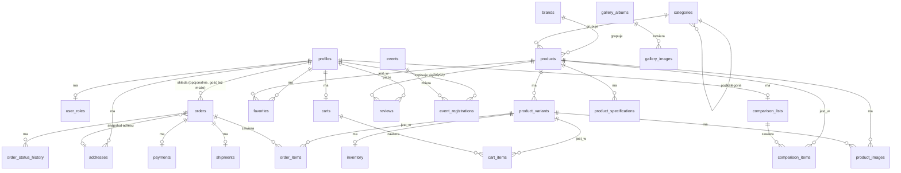
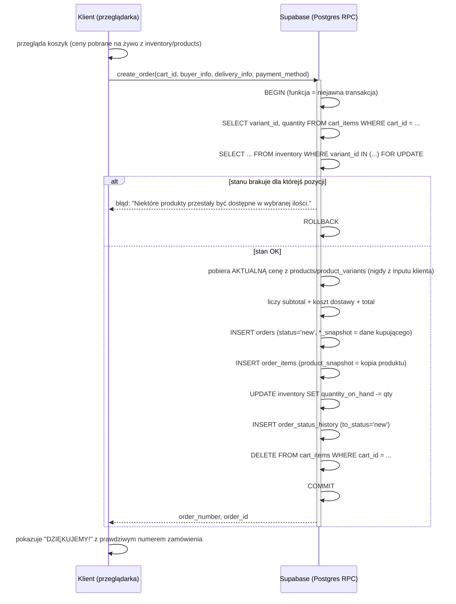
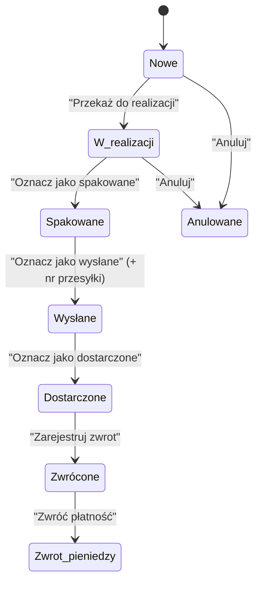

# SPARTANS ASG — Architektura systemu e-commerce

**Status: PROPOZYCJA — czeka na zatwierdzenie właściciela. Zero kodu produkcyjnego nie zostało jeszcze napisane.**

Ten dokument to ETAP 2 (z 16) pracy: audyt istniejącego projektu + pełna propozycja architektury backendu na Supabase. Implementacja zaczyna się dopiero po zaakceptowaniu tego planu, etapami, zgodnie z sekcją 15.

---

## 1. Analiza obecnego projektu

### 1.1 Co naprawdę jest w repozytorium

To jest najważniejsze odkrycie audytu i wpływa na całą resztę architektury, więc zaczynam od niego.

Strona **nie jest** standardową aplikacją React/TypeScript z `package.json`, folderami `src/`, routerem itd. Sprawdziłem to bezpośrednio — w repozytorium **nie ma** `package.json`, `vite.config`, `tsconfig`, folderu `node_modules`, ani żadnego pliku konfiguracyjnego bundlera. Cała strona to:

```
spartans-asg-site/
├── index.html              # przekierowanie 0-sekundowe do pliku poniżej
├── Spartans ASG.dc.html     # CAŁA strona — layout + logika w jednym pliku (~2 950 linii)
├── support.js                # silnik runtime wygenerowany przez narzędzie Claude Design
├── image-slot.js             # komponent web-component do placeholderów zdjęć
└── assets/                   # obrazki
```

`Spartans ASG.dc.html` to wyjście narzędzia **Claude Design** — własny format `.dc.html`:
- sekcja `<x-dc>...</x-dc>` to szablon HTML z bindingami `{{ zmienna }}`, `sc-if`, `sc-for`,
- sekcja `<script type="text/x-dc" data-dc-script">` to jedna klasa `Component extends DCLogic` z polem `state = {...}`, metodami jako pola strzałkowe i metodą `renderVals()`, która zwraca wszystko, czego szablon może użyć.

`support.js` (plik z komentarzem `// GENERATED from dc-runtime/src/*.ts — do not edit`) przy **każdym wejściu na stronę**:
1. dociąga z CDN (unpkg.com) React 18.3.1 UMD, ReactDOM 18.3.1 UMD i Babel Standalone,
2. **transpiluje kod JSX/klasy w przeglądarce** (Babel-in-browser), bez żadnego kroku budowania,
3. montuje wynik jako drzewo React.

**Konsekwencje, które trzeba świadomie zaakceptować albo zmienić:**

| Cecha obecnego stacku | Wpływ |
|---|---|
| Brak npm/bundlera | Nie da się zainstalować `@supabase/supabase-js` przez `npm install` — trzeba go dociągnąć jako `<script>` z CDN, tak jak resztę. Da się, ale to nie jest „normalny” frontend. |
| Cały kod w jednym pliku | Nie da się zrobić realnego podziału `services/`, `components/` jako osobnych plików — to jeden plik z jedną klasą. Można to uporządkować nazewniczo (grupowanie metod), ale nie fizycznie. |
| Babel-in-browser przy każdym ładowaniu | Zauważalne dla użytkownika opóźnienie startu (parsowanie + transpilacja ~90 KB kodu JS w przeglądarce), zależność od trzech zewnętrznych CDN-ów przy starcie — awaria unpkg.com = strona nie działa. Przy 10 000+ produktów (pkt 71 wymagań) to się nie skaluje dobrze. |
| Brak routera bibliotecznego | Własny, ręcznie pisany routing na `#/...` + `window.history` — działa, jest w porządku jakościowo, ale to nie jest coś, do czego można podłączyć standardowy „chroniony route” (`/admin` guard) w typowy sposób. |
| Brak testów, lintera, CI | Zero automatycznej weryfikacji przed wdrożeniem. |

To nie jest krytyka — na potrzeby wygenerowania prototypu marketingowego to narzędzie sprawdziło się bardzo dobrze i strona **wygląda i działa dobrze**. Ale to nie jest fundament, na którym buduje się panel administracyjny z kreatorem produktów, uploadem zdjęć, edytorem treści i routingiem `/admin/*` — nie dlatego, że to niemożliwe, ale dlatego, że robienie tego w tym formacie byłoby technicznie karkołomne i utrudniałoby utrzymanie kodu (naruszałoby zasadę „NO MAGIC” z pkt 73).

**Decyzja architektoniczna, którą proponuję i o którą proszę o potwierdzenie — patrz sekcja 3.1.**

### 1.2 Co już działa i ma zostać zachowane

Poniższe działa poprawnie i **nie będzie przepisywane** — dostanie tylko podłączenie do prawdziwych danych:

- Cały branding, layout, responsywność (świeżo doprowadzona do porządku), animacje, kolorystyka.
- Routing hash-based (`#/shop`, `#/product/:id`, `#/cart`, `#/checkout`, `#/account`, `#/favorites`, `#/compare`, `#/events`, `#/korengal`, `#/u3`, `#/gallery`, `#/eventy`, `#/about`, `#/info`).
- UI sklepu: filtry (kategoria, podkategoria, marka, waga, cena, „tylko dostępne/promocja/bestseller”), wyszukiwarka, sortowanie, panel filtrów jako bottom-sheet na mobile.
- UI koszyka, checkoutu (3 metody dostawy, 6 metod płatności — obecnie tylko UI, bez integracji), konta, ulubionych, porównania.
- UI wydarzeń (lista + archiwum + strony specjalne U3/Korengal), galerii, opinii-karuzeli na stronie głównej.
- Walidacja formularzy (checkout, logowanie/rejestracja) — zaimplementowana w tej sesji, działa poprawnie.

### 1.3 Gdzie dane są obecnie hardcoded

| Dane | Gdzie w kodzie | Ile rekordów |
|---|---|---|
| Produkty | `this.products = [...]` (linia ~1890) | 30 produktów, płaska struktura |
| Kategorie | `this.categories = [...]` (płaska lista stringów) + `this.subcategoriesMap` (2-poziomowa) | 10 kategorii głównych |
| Marki | `this.shopBrands = [...]` (płaska lista stringów) | 23 marki |
| Banery sklepu | `this.shopBanners = [...]` | 5 |
| Wydarzenia nadchodzące | `this.nearestEvent = {...}` | 1 (Niedzielne U3) |
| Archiwum wydarzeń | `this.archiveEvents = [...]` | 4, ze zdjęciami generowanymi syntetycznie (`Array.from({length:9})`) |
| Treść „Niedzielne U3” | `this.u3 = {...}` | 1 rozbudowany obiekt (cennik, regulamin, zasady) |
| Treść „Korengal” | `this.korengal = {...}` | 1 bardzo rozbudowany obiekt narracyjny (bloki tekst/zdjęcie, harmonogram, zasady zapisów) |
| Opinie (karuzela na stronie głównej) | `this.reviewsData = [...]` | 6 — **to NIE są opinie produktowe**, to ogólne testimoniale firmy (imię, gwiazdki jako tekst, treść) |
| Albumy galerii | `this.albums = [...]` | 4, zdjęcia generowane syntetycznie |
| Koszyk | `state.cart` | localStorage, tylko `{id, qty}` |
| Zamówienia | `state.orders` | **tylko w pamięci przeglądarki, znika po odświeżeniu** |
| Logowanie | `state.isLoggedIn`, `state.authForm` | **całkowicie fałszywe** — dowolny e-mail/hasło „loguje" bez żadnej walidacji względem czegokolwiek |
| Ulubione / porównanie | `state.favorites`, `state.compareList` | tylko w pamięci, znika po odświeżeniu |

---

## 2. Wykryte problemy

Uszeregowane wg wpływu na realny sklep:

1. **Logowanie jest atrapą.** Każdy e-mail + hasło „loguje" użytkownika. Zero bezpieczeństwa, zero prawdziwych kont.
2. **Zamówienia znikają po odświeżeniu strony.** `state.orders` żyje tylko w pamięci komponentu React — właściciel nigdy nie zobaczy złożonego zamówienia.
3. **Cena i stan magazynowy są całkowicie po stronie klienta.** Nic nie stoi na przeszkodzie, żeby ktoś przez DevTools zmienił `this.products[0].price` przed dodaniem do koszyka — bo nie ma żadnego backendu, który by to zweryfikował.
4. **Brak ochrony przed sprzedaniem tego samego produktu dwa razy** (race condition) — nie ma tu jeszcze nawet pojęcia „zapisu do bazy", więc pytanie jest teoretyczne, dopóki nie będzie backendu; ale musi być zaadresowane w nowej architekturze (pkt 32, 63.14 wymagań).
5. **Brak panelu administratora** — został świadomie usunięty w poprzedniej iteracji (widać to w historii commitów: „Remove admin panel"), bo był niekompletny/nietechniczny w złym sensie.
6. **Specyfikacje produktu są wyliczane, a nie realne.** To, co dziś wygląda jak „specyfikacja" na stronie produktu (Marka, Kategoria, Rodzaj, Waga, Wariant, Kod produktu) to pochodna istniejących pól produktu, **nie** dowolna lista parametr→wartość→jednostka, jakiej wymaga pkt 8. Trzeba to zbudować od zera jako nową funkcję.
7. **Warianty nie mają własnej ceny/stanu/SKU.** Dziś wariant to tylko etykieta tekstowa („Czarny", „oliwkowy") — cena i stan są wspólne dla całego produktu. Wymaganie pkt 7 („różne ceny, różne zdjęcia, różne stany magazynowe” per wariant) wymaga nowego modelu.
8. **Opinie na stronie głównej to nie jest system recenzji produktowych.** To, co wygląda jak „opinie klientów", to statyczne testimoniale niepowiązane z żadnym zamówieniem ani produktem. Prawdziwy system z pkt 33 (ocena 1–5, `verified purchase`, moderacja) nie istnieje i trzeba go zbudować w całości.
9. **Zapisy na wydarzenia idą dziś na zewnątrz.** Przycisk „ZAPISZ SIĘ” na Niedzielne U3 linkuje do zewnętrznego Google Forms (`nearestEvent.formsUrl`) — aplikacja nie ma własnych zapisów na wydarzenia, więc panel admina nie mógłby dziś pokazać realnej liczby zapisanych osób.
10. **Ulubione i porównanie znikają po odświeżeniu** — nie są nawet zapisywane w `localStorage`, tylko w pamięci komponentu.
11. **Zdjęcia to placeholdery.** Komponent `<image-slot>` renderuje opisowy placeholder (`imgHint`) zamiast prawdziwego pliku — bo nie ma jeszcze żadnego storage'u na obrazy.
12. **Brak realnej integracji płatności.** UI wybiera metodę płatności (BLIK, Przelewy24 itd.), ale nic nie jest faktycznie przetwarzane — zamówienie „potwierdza się" bez żadnej płatności.
13. **Frontend nie ma ról.** Nie ma pojęcia „klient" vs „admin" — więc dziś fizycznie nie da się zbudować chronionej ścieżki `/admin`.

Żaden z tych problemów nie jest zaskoczeniem — to naturalny stan projektu, który dotąd był demem/makietą UI. Wszystkie da się rozwiązać architekturą poniżej.

---

## 3. Proponowana architektura

```
┌─────────────────────────────┐        ┌──────────────────────────────┐
│   SKLEP (istniejący plik)    │        │   PANEL ADMINA (nowa apka)    │
│   Spartans ASG.dc.html       │        │   React + TypeScript + Vite   │
│   — ten sam wygląd i UX —    │        │   /admin/*                    │
└──────────────┬───────────────┘        └───────────────┬────────────────┘
               │  @supabase/supabase-js (CDN)            │  @supabase/supabase-js (npm)
               │  tylko klucz publishable                │  tylko klucz publishable
               └───────────────────┬──────────────────────┘
                                    │
                                    ▼
                     ┌───────────────────────────┐
                     │          SUPABASE           │
                     │  ┌───────────────────────┐  │
                     │  │ Auth (użytkownicy,     │  │
                     │  │ sesje, role)           │  │
                     │  ├───────────────────────┤  │
                     │  │ PostgreSQL             │  │
                     │  │ + Row Level Security   │  │
                     │  │ + funkcje/triggery     │  │
                     │  ├───────────────────────┤  │
                     │  │ Storage                │  │
                     │  │ (zdjęcia produktów,    │  │
                     │  │ galeria, marki, wyd.)  │  │
                     │  └───────────────────────┘  │
                     └───────────────────────────┘
```

### 3.1 Kluczowa decyzja: dwie aplikacje, jeden backend — proszę o potwierdzenie

To jest jedyny punkt w tym dokumencie, w którym świadomie odchodzę od dosłownego brzmienia specyfikacji („frontend już istnieje, nie przepisuj") i chcę to jasno wytłumaczyć zamiast po prostu zdecydować za Ciebie.

**Sklep (`Spartans ASG.dc.html`) zostaje tym samym plikiem, w tym samym formacie.** Zamiast tablic `this.products = [...]` będzie pobierał dane z Supabase przez `@supabase/supabase-js` dociągnięty z CDN (dokładnie tak, jak dziś dociągane jest React/Babel) — bez zmiany wyglądu, UX ani routingu. To realizuje „nie przepisuj strony bez potrzeby" dosłownie.

**Panel administratora będzie nową aplikacją** (React + TypeScript + Vite, z prawdziwym `package.json`, routerem, podziałem na foldery), osobno wdrażaną (np. `admin.spartans-asg...` albo osobny branch GitHub Pages / Vercel), gadającą z tym samym projektem Supabase.

Dlaczego, a nie „dopisz panel admina do istniejącego pliku":
- Kreator dodawania produktu (8 kroków), drag&drop zdjęć, edytor rich-text, routing `/admin/products/:id` z prawdziwą ochroną — to są rzeczy, które w formacie jednego pliku z Babel-in-browser i ręcznym routerem dałoby się zrobić, ale kosztem czytelności i utrzymywalności, wprost naruszając zasadę „NO MAGIC" (pkt 73) i zasadę prostoty (pkt 4: „nie buduj mikroserwisów [...] system ma być prosty" — jednoplikowy monolit z admin-kreatorem wewnątrz jest *mniej* prosty, nie bardziej).
- Sam dokument specyfikacji to explicite dopuszcza: **pkt 70** mówi „Panel admina może być nowym interfejsem" — więc to nie jest odejście od Twoich wytycznych, to skorzystanie z furtki, którą sam zostawiłeś.
- Bezpieczeństwo: osobna aplikacja admina, osobno budowana i wdrażana, naturalnie nie eksponuje żadnego kodu panelu administracyjnego w publicznym pliku sklepu (mniejsza powierzchnia ataku, mniejszy plik do pobrania dla zwykłego klienta).

**Jeśli wolisz inaczej — jeden wspólny projekt (np. migrację całego sklepu do Vite/React i panel jako część tego samego projektu) — to również jest możliwe, ale oznacza przepisanie strony sklepu, czego punkt 70 wprost zabrania „bez potrzeby". Proszę o Twoją decyzję zanim zacznę ETAP 3.**

### 3.2 Stack

- **Baza danych:** PostgreSQL (Supabase) — pełna normalizacja, klucze obce, indeksy.
- **Auth:** Supabase Auth (e-mail/hasło; miejsce na przyszłe OAuth, jeśli zajdzie potrzeba).
- **Storage:** Supabase Storage — zdjęcia produktów, galerii, marek, wydarzeń. Nigdy blob w Postgresie.
- **Logika serwerowa:** w większości funkcje PostgreSQL (`SECURITY DEFINER`, wywoływane przez RPC z frontendu) — bo cała potrzebna logika (atomowe tworzenie zamówienia, zmiana statusu, generowanie SKU/slug) da się wyrazić w SQL/plpgsql bez dodatkowej warstwy serwera.
- **Edge Functions:** zarezerwowane pod przyszłą integrację e-mail/płatności (Stripe/Przelewy24 webhook) — nie są potrzebne na start, więc nie są budowane teraz (zgodnie z pkt 4: „Edge Functions tylko tam, gdzie są rzeczywiście potrzebne").
- **Brak:** mikroserwisów, Kubernetes, Kafka, Redis, własnego serwera Node/Express. Nie są potrzebne przy tej skali.

### 3.3 Bezpieczeństwo kluczy

- Sklep i panel admina dostają w kodzie **wyłącznie** `VITE_SUPABASE_URL` i `VITE_SUPABASE_PUBLISHABLE_KEY` (anon key).
- `service_role key` nigdy nie trafia do żadnego pliku wysyłanego do przeglądarki — używany wyłącznie lokalnie do migracji/seedu przez Supabase CLI.
- `.env.example` (oba projekty):
  ```
  VITE_SUPABASE_URL=
  VITE_SUPABASE_PUBLISHABLE_KEY=
  ```
- `.gitignore` dopisuje `.env`, `.env.local`.
- Cała logika, której nie wolno wykonać bez uprawnień (zmiana ceny, zmiana statusu zamówienia, nadanie roli), jest wymuszona przez **RLS + funkcje SECURITY DEFINER**, nie przez ukrycie przycisku w UI (patrz sekcja 7 i pkt 52/63 wymagań).

---

## 4. Struktura bazy danych

### 4.1 Diagram relacji (uproszczony — bez kolumn technicznych)



### 4.2 Pełna lista tabel z kolumnami

Konwencje: `id uuid default gen_random_uuid() primary key` wszędzie, `created_at timestamptz default now()` wszędzie, ceny zawsze `numeric(10,2)`, waluta zawsze `'PLN'` domyślnie.

#### `profiles`
Dane osobowe — hasła i e-mail żyją w `auth.users`, nie tutaj.
| kolumna | typ | uwagi |
|---|---|---|
| id | uuid PK | = `auth.users.id` |
| first_name | text | |
| last_name | text | |
| phone | text | |
| date_of_birth | date | nullable — potrzebne pod 18+ produkty |
| created_at, updated_at | timestamptz | |

#### `user_roles`
**Celowo osobna tabela od `profiles`** — to jest standardowy, zalecany przez Supabase wzorzec bezpieczeństwa: rola NIGDY nie może siedzieć w tabeli, którą użytkownik może edytować przez zwykłe „zapisz profil" (inaczej ktoś przez DevTools ustawia sobie `role: 'admin'`). Patrz sekcja 7.2.
| kolumna | typ | uwagi |
|---|---|---|
| user_id | uuid FK → profiles | |
| role | enum `app_role` (`customer`, `manager`, `admin`) | |
| unique(user_id, role) | | jeden użytkownik może mieć więcej niż jedną rolę w przyszłości, ale nie duplikaty |

#### `addresses`
| kolumna | typ | uwagi |
|---|---|---|
| id, user_id FK | | |
| label | text | np. „Dom", „Praca" |
| imie, nazwisko, telefon | text | |
| linia1, linia2 | text | |
| kod_pocztowy, miasto, kraj | text | kraj domyślnie `'Polska'` |
| is_default | boolean | |

#### `brands`
| id, name, slug (unique), logo_storage_path, created_at |

#### `categories`
Hierarchiczne — samoreferencja `parent_id`.
| id, parent_id FK→categories (nullable), name, slug (unique), sort_order, created_at |

#### `products`
| kolumna | typ | uwagi |
|---|---|---|
| id, sku (unique, nullable → auto-generowane, patrz 4.4) | | |
| name, slug (unique) | | |
| description (długi opis), short_description | text | |
| brand_id FK→brands (nullable), category_id FK→categories | | |
| base_price numeric(10,2) | | |
| sale_price numeric(10,2) nullable | | jeśli ustawione i < base_price → produkt „w promocji" |
| currency | text default `'PLN'` | |
| is_active, is_featured, is_18_plus | boolean | |
| low_stock_threshold | int default 3 | globalny fallback; realny próg trzyma `inventory` per wariant |
| created_at, updated_at, created_by FK→profiles | | |

#### `product_variants`
**Każdy produkt ma zawsze ≥1 wariant** — nawet gdy admin nie zdefiniuje żadnego, system tworzy automatycznie wariant „Standard". Dzięki temu `inventory`, `cart_items` i `order_items` zawsze wskazują na `product_variants.id`, nigdy na `products.id` bezpośrednio — jedna spójna ścieżka zamiast dwóch (z wariantem / bez wariantu), co eliminuje całą klasę błędów przy sprawdzaniu stanu i ceny.
| id, product_id FK, sku (unique, nullable), label (np. „Czarny", „Standard"), price_override numeric nullable (gdy null → cena z produktu), is_active |

#### `product_images`
| id, product_id FK, variant_id FK nullable, storage_path, alt_text, sort_order, is_primary, created_at |
Storage bucket: `product-images`, ścieżka: `products/{product_id}/{plik}`.

#### `product_specifications`
Dowolne parametry, bez zmiany schematu bazy — dokładnie to, czego wymaga pkt 8.
| id, product_id FK, spec_name (np. „FPS"), spec_value (np. „350"), spec_unit nullable (np. „FPS"), sort_order |

#### `inventory`
Jedna sprawdzona wartość prawdy o stanie magazynowym — jeden rekord na wariant.
| variant_id FK→product_variants (unique, PK), quantity_on_hand int (`check >= 0`), low_stock_threshold int default 3, updated_at |

#### `carts` / `cart_items`
| carts: id, user_id FK (unique — jeden aktywny koszyk na użytkownika), created_at, updated_at |
| cart_items: id, cart_id FK, variant_id FK, quantity int (`check > 0`), added_at, unique(cart_id, variant_id) |

#### `orders`
| kolumna | typ | uwagi |
|---|---|---|
| id, order_number (text, unique, np. `SP-2026-00142`) | | |
| user_id FK nullable | | **nullable** — istniejący UI ma „Kontynuuj jako gość", to zostaje |
| status | enum `order_status` (`new`, `processing`, `packed`, `shipped`, `delivered`, `cancelled`, `returned`, `refunded`) | |
| currency, subtotal, shipping_cost, total | numeric | |
| payment_method, delivery_method | text | |
| buyer_snapshot | jsonb | imię/nazwisko/telefon/e-mail w momencie zakupu |
| shipping_address_snapshot | jsonb nullable | |
| invoice_details_snapshot | jsonb nullable | |
| notes | text nullable | |
| created_at, updated_at | | |

#### `order_items`
Snapshot jest obowiązkowy (pkt 31) — stare zamówienie nie może się zmienić, gdy produkt zmieni cenę/nazwę/zniknie.
| id, order_id FK, product_id FK nullable (zostaje nawet po usunięciu produktu — `on delete set null`), variant_id FK nullable, product_name_snapshot, sku_snapshot, unit_price_snapshot numeric, quantity int, line_total numeric, product_snapshot jsonb (pełna kopia rekordu produktu w momencie zakupu) |

#### `order_status_history`
| id, order_id FK, from_status, to_status, changed_by FK→profiles nullable, note text nullable, created_at |

#### `payments`
Gotowe pod Stripe/PayU/Przelewy24/BLIK — nigdy dane karty.
| id, order_id FK, provider, provider_payment_id nullable, status, amount, currency, created_at, updated_at |

#### `shipments`
Gotowe pod InPost/kuriera/odbiór osobisty.
| id, order_id FK, carrier, method, tracking_number nullable, status, created_at, updated_at |

#### `favorites`
| id, user_id FK, product_id FK, created_at, unique(user_id, product_id) |

#### `comparison_lists` / `comparison_items`
Dziś porównanie żyje tylko w pamięci przeglądarki i znika po odświeżeniu — nowy model daje mu trwałość (jak koszyk), max. 4 pozycje wymuszone w aplikacji.
| comparison_lists: id, user_id FK unique |
| comparison_items: id, comparison_list_id FK, product_id FK, added_at, unique(comparison_list_id, product_id) |

#### `reviews`
Nowa funkcja — nie istnieje dziś w żadnej formie (karuzela na stronie głównej to coś innego, patrz problem #8).
| id, product_id FK, user_id FK, order_item_id FK nullable (do potwierdzenia `verified_purchase`), rating smallint (`check between 1 and 5`), title, body, is_verified_purchase boolean, status enum (`pending`,`published`,`hidden`), created_at, updated_at |

#### `events`
| kolumna | typ | uwagi |
|---|---|---|
| id, slug (unique), name | | |
| short_description | text | |
| cover_image_storage_path | text nullable | |
| event_date, event_time | date, time | |
| location | text | |
| price | numeric nullable | |
| capacity | int nullable | |
| status | enum (`draft`,`published`,`closed`,`cancelled`) | |
| content | jsonb nullable | **na treści narracyjne w stylu „Korengal"** — bloki tekst/zdjęcie/harmonogram/zasady, patrz 4.3 |
| external_form_url | text nullable | zachowuje dzisiejszą możliwość linkowania na zewnątrz zamiast własnego formularza |
| created_at, updated_at, created_by | | |

#### `event_registrations`
| id, event_id FK, user_id FK nullable (goście też mogą się zapisać), imie, nazwisko, email, telefon, status, created_at |

#### `gallery_albums` / `gallery_images`
| gallery_albums: id, name, slug, cover_image_storage_path, sort_order, created_at |
| gallery_images: id, album_id FK, storage_path, caption nullable, sort_order, created_at |

#### `admin_logs`
| id, actor_id FK→profiles, action (text, np. `order_status_changed`), entity_type (text, np. `order`), entity_id uuid, before jsonb nullable, after jsonb nullable, created_at |

### 4.3 Uwaga o „Korengal" i podobnych wydarzeniach narracyjnych

Audyt pokazał, że wydarzenia w tym projekcie **nie są jednorodne**. „Niedzielne U3" to prosty, cykliczny event (nazwa/data/cena/opis) — idealnie pasuje do prostego kreatora z pkt 35. „Korengal" to rozbudowana strona z narracją (naprzemienne bloki tekst/zdjęcie), harmonogramem dnia po dniu i wielostronicowym regulaminem zapisów — to bliżej mini-CMS niż formularza.

Propozycja: kolumna `events.content jsonb` przechowuje taką strukturę tylko dla eventów, które jej potrzebują. Prosty kreator z pkt 16 (Nazwa/Zdjęcie/Opis/Data/Godzina/Miejsce/Cena/Limit/Status) obsługuje **wszystkie** eventy od razu. Edycja rozbudowanej treści narracyjnej (`content`) dostaje **osobny, prostszy niż SQL, ale bardziej zaawansowany niż podstawowy kreator edytor** (lista bloków „dodaj akapit tekstu" / „dodaj zdjęcie" z podpisem) w ETAP 11 — nie jest to blokujące dla startu panelu zamówień/produktów.

### 4.4 Automatyzacje (funkcje/triggery Postgres)

- `generate_sku()` — trigger `BEFORE INSERT` na `products`: jeśli `sku IS NULL`, generuje `SP-000001`, `SP-000002`... (sekwencja).
- `generate_slug(text)` — funkcja generująca slug z nazwy (`Specna Arms EDGE 2.0` → `specna-arms-edge-2-0`), wywoływana z triggera; przy konflikcie dopisuje `-2`, `-3`...
- `ensure_default_variant()` — trigger `AFTER INSERT` na `products`: jeśli admin nie doda żadnego wariantu, tworzy automatycznie wariant „Standard" + wiersz w `inventory` z `quantity_on_hand = 0`.
- `create_order(...)` — funkcja RPC `SECURITY DEFINER`, patrz sekcja 8.
- `admin_update_order_status(...)` — funkcja RPC `SECURITY DEFINER`, patrz sekcja 9.
- `has_role(uuid, app_role)` — funkcja pomocnicza do RLS, patrz sekcja 7.2.

---

## 5. Relacje tabel — najważniejsze ścieżki

- `products (1) → (N) product_variants (1) → (1) inventory` — cena i stan zawsze idą przez wariant, nigdy bezpośrednio przez produkt.
- `orders (1) → (N) order_items` — `order_items` ma **własne kopie** (`*_snapshot`) nazwy/ceny/SKU, nie polega na aktualnym stanie `products`.
- `carts (1) → (N) cart_items (N) → (1) product_variants` — koszyk zawsze odwołuje się do wariantu, cena w koszyku jest **liczona na żywo** z bazy, nigdy nie jest zapisana w `cart_items`.
- `user_roles` jest **odklejona** od `profiles` — patrz sekcja 7.2, dlaczego to jest wymagane, a nie stylistyczne.

---

## 6. Modele

### 6.1 Model użytkowników
- Rejestracja/logowanie/reset hasła/sesja → w całości Supabase Auth (e-mail + hasło na start).
- Przy pierwszym logowaniu trigger `handle_new_user()` tworzy wiersz w `profiles` i domyślną rolę `customer` w `user_roles`.
- Nikt sam sobie nie nadaje roli `admin`/`manager` — te role nadaje wyłącznie inny admin przez panel (insert do `user_roles` chroniony RLS, patrz 7.1) albo ręcznie przy pierwszym uruchomieniu (patrz README, pkt „tworzenie pierwszego administratora").

### 6.2 Model produktów
Produkt bez wariantów i produkt z wariantami są **tym samym kształtem danych** (patrz „automatyczny wariant Standard" w 4.4) — frontend sklepu i panel admina nie muszą rozróżniać dwóch ścieżek kodu.

### 6.3 Model zamówień
Zamówienie = migawka. Po złożeniu zamówienia zmiana produktu (cena, nazwa, usunięcie) **nigdy** nie wpływa na już złożone zamówienia — wymuszone przez `*_snapshot` w `order_items` (pkt 31).

### 6.4 Model magazynu
`inventory.quantity_on_hand` to jedyne źródło prawdy. `check (quantity_on_hand >= 0)` na poziomie bazy fizycznie uniemożliwia ujemny stan (pkt 32). Race condition (dwóch klientów, jedna sztuka) rozwiązane blokadą wiersza `SELECT ... FOR UPDATE` wewnątrz `create_order()` — patrz sekcja 8.

### 6.5 Model panelu administratora
Panel to osobna aplikacja z własnym routerem (sekcja 3.1). Każda trasa `/admin/*` sprawdza rolę użytkownika (guard po stronie frontendu **i** RLS po stronie bazy — nigdy tylko jedno, patrz pkt 52/63).

---

## 7. System RLS

### 7.1 Zasady per tabela (streszczenie)

| Tabela | Klient (customer) | Admin/Manager |
|---|---|---|
| `products`, `product_variants`, `product_images`, `product_specifications` | SELECT tylko gdzie `is_active = true` | pełny CRUD |
| `categories`, `brands` | SELECT wszystko | pełny CRUD |
| `inventory` | brak dostępu bezpośredniego (ilość widoczna tylko jako „dostępny / niedostępny / ostatnie N szt." przez widok, nigdy surowa liczba jeśli nie chcemy jej ujawniać — do ustalenia, domyślnie: SELECT dozwolony, UPDATE zabroniony) | pełny CRUD |
| `profiles` | SELECT/UPDATE tylko własny wiersz (`auth.uid() = id`) | SELECT wszystkie, UPDATE ograniczone (bez nadpisywania roli — rola nie jest tu przechowywana) |
| `user_roles` | SELECT tylko własne role | INSERT/UPDATE/DELETE tylko admin |
| `addresses`, `favorites`, `comparison_lists`, `comparison_items`, `carts`, `cart_items` | pełny CRUD, ale tylko na `user_id = auth.uid()` | SELECT wszystkie (obsługa klienta) |
| `orders`, `order_items` | SELECT tylko własne (`user_id = auth.uid()`); INSERT tylko przez funkcję `create_order()`, nigdy bezpośredni `insert` | pełny CRUD |
| `order_status_history` | SELECT tylko dla własnych zamówień | INSERT tylko przez `admin_update_order_status()` |
| `payments`, `shipments` | SELECT tylko dla własnych zamówień | pełny CRUD |
| `reviews` | SELECT tylko `status = 'published'` (+ własne niezależnie od statusu); INSERT własna recenzja | UPDATE `status` (moderacja) |
| `events`, `gallery_albums`, `gallery_images` | SELECT tylko `status = 'published'` (dla eventów) / wszystko (galeria) | pełny CRUD |
| `event_registrations` | INSERT własny zapis, SELECT własne zapisy | SELECT wszystkie, UPDATE status |
| `admin_logs` | brak dostępu | SELECT (tylko admin, nie manager — dziennik zmian to wrażliwe dane) |

### 7.2 Dlaczego `user_roles` to osobna tabela, a nie kolumna w `profiles`

To jest jeden z najczęstszych błędów bezpieczeństwa w tego typu systemach, więc tłumaczę wprost: jeśli rola siedziałaby jako kolumna `profiles.role`, a `profiles` ma politykę „użytkownik może `UPDATE` własny wiersz" (co jest potrzebne, żeby klient mógł zmienić imię/telefon) — to klient mógłby w tym samym zapytaniu dopisać `role: 'admin'` i **sam sobie nadać uprawnienia administratora**. Osobna tabela `user_roles`, do której klient ma wyłącznie `SELECT` (nigdy `INSERT`/`UPDATE`/`DELETE` na własny rekord), eliminuje tę ścieżkę ataku całkowicie. Sprawdzanie roli w RLS innych tabel odbywa się przez funkcję pomocniczą:

```sql
create function has_role(_user_id uuid, _role app_role)
returns boolean
language sql stable security definer
as $$
  select exists (
    select 1 from user_roles
    where user_id = _user_id and role = _role
  )
$$;
```

`security definer` + funkcja (zamiast bezpośredniego podzapytania w polityce RLS) jest tu też celowe: zapobiega nieskończonej rekurencji RLS (polityka na `user_roles`, która sama odpytuje `user_roles`).

---

## 8. Przepływ checkoutu



Kluczowe zasady (odpowiadają wprost na pkt 29, 30, 31, 32 wymagań):
- Frontend **nigdy** nie wysyła ceny — tylko `variant_id` + `quantity`. Cenę zawsze dolicza baza.
- `FOR UPDATE` blokuje wiersz `inventory` na czas transakcji — jeśli dwóch klientów kupuje ostatnią sztukę jednocześnie, drugi zapytanie czeka, a po zwolnieniu blokady widzi już zmniejszony stan i dostaje błąd „produkt niedostępny", zamiast obaj kupić tę samą jedną sztukę.
- Cały blok jest jedną funkcją PL/pgSQL = jedna transakcja = albo wszystko się zapisze, albo nic (pkt 29.13 „Całość musi być atomowa").
- Guest checkout (`user_id = null`) pozostaje wspierany — to jest istniejąca funkcja UI („Kontynuuj jako gość"), nie wprowadzam tu regresji.

---

## 9. Przepływ zmiany statusu zamówienia



Każde kliknięcie w panelu admina wywołuje `admin_update_order_status(order_id, new_status, note)`:
1. funkcja sprawdza `has_role(auth.uid(), 'admin') or has_role(auth.uid(), 'manager')` — jeśli nie, `raise exception` (obrona **w** funkcji, nie tylko przez RLS na tabeli — pkt 52 „RLS/backend musi również blokować dostęp", nie tylko UI),
2. `UPDATE orders SET status = new_status, updated_at = now()`,
3. `INSERT INTO order_status_history (order_id, from_status, to_status, changed_by, note)`,
4. `INSERT INTO admin_logs (actor_id, action='order_status_changed', entity_type='order', entity_id=order_id, before=..., after=...)`,
5. (przygotowane pod przyszłość, nie zaimplementowane teraz) miejsce na wywołanie powiadomienia e-mail — patrz sekcja 10.

Klient w `/account` widzi zmianę statusu automatycznie przy następnym odświeżeniu/zapytaniu (RLS pozwala mu czytać własne `orders`/`order_status_history`) — nie jest potrzebny realtime na start, ale Supabase Realtime na tabeli `orders` jest gotową, prostą opcją do dodania później, jeśli zechcesz „status aktualizuje się bez odświeżania".

### 9.1 Powiadomienia (architektura pod przyszłość, pkt 27)

Tabela `order_status_history` + `admin_logs` już dają pełny ślad zdarzeń potrzebny do wysyłki e-maili. Docelowo: trigger `AFTER INSERT` na `order_status_history` wywołujący Edge Function, która woła zewnętrzny provider e-mail (np. Resend/Postmark). Nie buduję tego teraz (nie ma dziś dostawcy e-mail do podłączenia), ale schemat bazy niczego tu nie blokuje — to jedyna faktycznie odłożona rzecz w całym dokumencie, i jest odłożona bo sama specyfikacja to dopuszcza w pkt 27.

---

## 10. Plan migracji istniejących danych

Nie wymyślam danych, których nie ma (pkt 49). Co realnie da się zmigrować z hardcoded danych, i co zostaje jako `TODO`:

| Dane źródłowe | Migracja | Uwagi |
|---|---|---|
| 30 produktów z `this.products` | → `products` + automatyczny wariant „Standard" (z etykietami z `variants[]` jako dodatkowe warianty tam, gdzie produkt miał >1 wariant, np. „Czarny"/„oliwkowy") + `inventory.quantity_on_hand = stan` | `sku` = **TODO**, generowany automatycznie (`SP-000001`...), bo dzisiejsze `id` to slug, nie SKU |
| `category` + `subcategoriesMap` | → `categories` (2 poziomy: rodzic + dziecko) | |
| `shopBrands` (23 nazwy) | → `brands` (bez logo — **TODO**: logo do dodania przez admina) | |
| `imgHint` / `slotId` | → **TODO**, brak realnych plików zdjęć — placeholdery zostają placeholderami do czasu, aż właściciel wgra prawdziwe zdjęcia przez kreator produktu | |
| Specyfikacje wyliczane (Marka/Kategoria/Rodzaj/Waga/Wariant) | → NIE migrować jako `product_specifications` — to są inne pola (relacje, nie dowolne atrybuty). `product_specifications` startuje **pusta**, właściciel dodaje FPS/Hop-Up/Gearbox itd. ręcznie przez „+ DODAJ PARAMETR" | |
| `nearestEvent`, `archiveEvents`, `u3`, `korengal` | → `events` (5 rekordów: 1 nadchodzący cykliczny „Niedzielne U3" + 4 archiwalne), treść `u3`/`korengal` → `events.content jsonb` | zdjęcia archiwalne dziś generowane syntetycznie → **TODO**, prawdziwe pliki |
| `reviewsData` (6 testimoniali) | **NIE migrować do `reviews`** — to nie są recenzje produktowe (patrz problem #8). Zostają jako statyczna treść marketingowa na stronie głównej, poza nowym systemem `reviews` | `reviews` startuje pusta — to nowa funkcja |
| `albums` (4 albumy) | → `gallery_albums`, zdjęcia → **TODO** (dziś syntetyczne) | |
| `state.cart`, `state.orders`, `state.favorites`, `state.compareList` | **NIE migrować** — to dane sesji przeglądarki konkretnych osób odwiedzających demo, nie dane biznesowe | |

Plik seed: `supabase/migrations/006_seed.sql` — zawiera wyłącznie dane z lewej kolumny powyżej, każdy `TODO` jest jawnie skomentowany w SQL, żeby było widać, co czeka na uzupełnienie przez właściciela.

---

## 11. Plan implementacji (ETAP 3–16)

Zgodnie z wymaganym trybem pracy etapami (pkt 76) — każdy etap kończy się działającym, przetestowanym stanem, zero „TODO — naprawić później" dla rzeczy niezbędnych do działania danego etapu.

| Etap | Zakres | Wyjście |
|---|---|---|
| **3. Baza danych** | `supabase/migrations/001_initial_schema.sql`...`006_seed.sql` (schemat, indeksy, RLS, funkcje, triggery, seed) | Baza gotowa, RLS przetestowane ręcznie |
| **4. Auth** | Supabase Auth podłączony w sklepie zamiast fałszywego `isLoggedIn` | Rejestracja/logowanie/wylogowanie/reset hasła działają naprawdę |
| **5. Produkty (sklep)** | Zapytania do `products`/`categories`/`brands`/`inventory` zamiast tablic | Sklep pokazuje te same 30 produktów, ale z bazy |
| **6. Panel admina — produkty** | Nowa apka: lista, kreator 8-kroków, edycja, ukrywanie, upload zdjęć, specyfikacje | Właściciel dodaje/edytuje produkt bez pomocy programisty |
| **7. Koszyk** | `carts`/`cart_items` zamiast `localStorage` dla zalogowanych; goście nadal `localStorage` | Koszyk synchronizuje się między urządzeniami po zalogowaniu |
| **8. Zamówienia (checkout)** | `create_order()` podłączone pod istniejący UI checkoutu | Złożone zamówienie faktycznie zapisuje się w bazie, zmniejsza stan |
| **9. Panel admina — zamówienia** | Lista z zakładkami statusów, szczegóły, zmiana statusu | Właściciel widzi i realizuje prawdziwe zamówienia |
| **10. Konto klienta** | `/account`, `/favorites`, `/compare` na żywych danych, historia zamówień z timeline | Klient widzi swoje prawdziwe zamówienia i status |
| **11. Wydarzenia** | `events`/`event_registrations` + panel admina | Właściciel dodaje wydarzenie bez Google Forms |
| **12. Opinie** | Nowy system recenzji produktowych + moderacja w adminie | Klient ocenia kupiony produkt, admin publikuje/ukrywa |
| **13. Galeria** | `gallery_albums`/`gallery_images` + panel admina | Właściciel zarządza albumami bez pomocy programisty |
| **14. Bezpieczeństwo** | 14-punktowa lista z pkt 63 — testowana ręcznie i naprawiana | Zero luk z listy |
| **15. Testy** | Plan testów z pkt 64 wykonany | Wszystko na liście zweryfikowane |
| **16. Audyt końcowy + dokumentacja** | Cztery audyty z pkt 75 + `README.md`, `SECURITY.md`, `ADMIN_GUIDE.md` | Właściciel ma instrukcję „jak dodać produkt" krok po kroku, zero SQL |

Po każdym etapie: uruchamiam to, co da się uruchomić (podgląd w przeglądarce), sprawdzam błędy konsoli/sieci, naprawiam przed przejściem dalej — dokładnie jak w tej sesji wcześniej przy naprawianiu sklepu.

---

## 12. Co jeszcze wymaga Twojej decyzji przed startem ETAP 3

1. **Sekcja 3.1** — potwierdzenie: sklep zostaje jednym plikiem `.dc.html` z Supabase podpiętym przez CDN, panel admina to nowa, osobna apka React/Vite. Czy się zgadzasz, czy wolisz inny podział?
2. **Hosting panelu admina** — czy ma to być osobny branch/repo wdrażany też na GitHub Pages (subpath `/admin`), czy wolisz osobną usługę (Vercel/Netlify)? Wpływa to na routing i konfigurację CORS w Supabase.
3. **Projekt Supabase** — czy masz już założony projekt (URL + klucze), czy mam poprowadzić Cię przez założenie nowego?
4. **Zdjęcia** — czy chcesz teraz wgrać prawdziwe zdjęcia produktów/wydarzeń/galerii (są w folderze `asg/` jako pliki `.jpg`/`.webp` już na dysku), czy zostawiamy placeholdery na start i wgrywasz zdjęcia sam przez kreator produktu później?

Po Twojej odpowiedzi zaczynam ETAP 3 (baza danych) i idę etapami zgodnie z planem w sekcji 11 — z raportem po każdym etapie, zanim przejdę do kolejnego.
